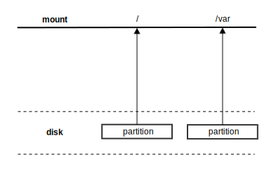
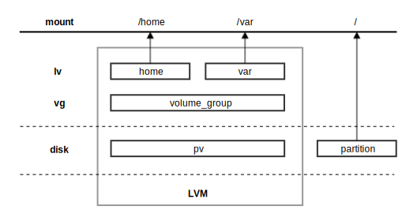
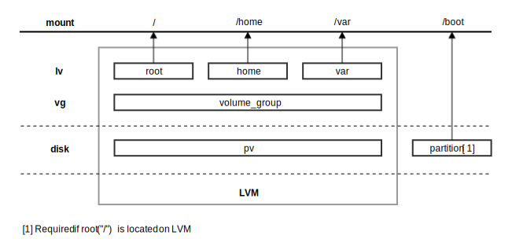

Deployment
++++++++++

Conceptual Overview
===================

The following is a conceptual overview of the bareon deployment process
and how it can be customised.

User example:  As a sys admin, I am managing a cluster of diskful nodes
and I want to provision all of these nodes with my custom
operating system.

Deployment:

* With the required images referenced, deployment is invoked using nova boot \
  (see `Invoking Deployment`_)
* Disks local to each node are partitioned according to a user provided schema \
  (see `Deploy Configuration`_)
* The OS image or images (see `Multiboot`_) \
  are transferred using rsync or swift (see `Image Transfer`_)
* Arbitrary actions, as defined in a user supplied schema are executed \
  (optional, see `Driver Actions`_)
* If an error occurred during deployment an on_fail_script can be configured to run \
  (optional, see `on_fail_script`_)
* Deployment is complete and the node reboots from its local storage.

Post deployment (optional):

* Additional driver actions can be performed \
  (see `Driver Actions`_)
* Nodes can be rebuilt (see `Rebuilding Nodes`_) \
  or verified without modifying existing content \
  (see `Redeploying Without Modifying Content`_)

Invoking Deployment
===================

Required Images
---------------

The following images are required for successful deployment using the bareon agent
(for storage options see `Url Resolution`_ below):

+------------------------+--------------+------------------------------+------------------------------------------------------------------------------------+-----------------------------------------+
| Image                  |              | Example                      | Description                                                                        | Referenced by:                          |
+========================+==============+==============================+====================================================================================+=========================================+
| Bareon RAM disk        | Required     | bareon/initramfs.1           | Used by bareon to deploy nodes [1]                                                 | ironic node                             |
+------------------------+--------------+------------------------------+------------------------------------------------------------------------------------+-----------------------------------------+
| Bareon kernel          | Required     | bareon/kernel.1              | Used by bareon to deploy nodes [1]                                                 | ironic node                             |
+------------------------+--------------+------------------------------+------------------------------------------------------------------------------------+-----------------------------------------+
| OS image               | Required     | centos-7.1.1503.raw          | OS and filesystem                                                                  | nova boot                               |
+------------------------+--------------+------------------------------+------------------------------------------------------------------------------------+-----------------------------------------+
| Default deploy schema  | Required     | cloud_default_deploy_config  | Bareon deployment configuration                                                    | /etc/ironic/ironic.conf                 |
+------------------------+--------------+------------------------------+------------------------------------------------------------------------------------+-----------------------------------------+
| Optional deploy schema | Recommended  | deploy_config                | Appends default schema, overrides on conflict                                      | nova boot                               |
+------------------------+--------------+------------------------------+------------------------------------------------------------------------------------+-----------------------------------------+
| Driver actions         | Optional     | actions_list                 | List of arbitrary actions to be ran during/post deployment                         | nova boot                               |
+------------------------+--------------+------------------------------+------------------------------------------------------------------------------------+-----------------------------------------+
| on_fail_script         | Optional     | on_fail_script               | Bash script to be ran on deployment failure                                        | deploy schema                           |
+------------------------+--------------+------------------------------+------------------------------------------------------------------------------------+-----------------------------------------+
| SSH private key        | Optional     | id_rsa                       | Required to run driver actions post deployment or switch between multiboot images  | nova boot                               |
+------------------------+--------------+------------------------------+------------------------------------------------------------------------------------+-----------------------------------------+

[1] The bareon RAM disk and kernel images are built using ``bareon/tests_functional/image_build/centos_minimal.sh`` and can be found at ``/tmp/rft_image_build``.

URL Resolution
^^^^^^^^^^^^^^

References given to the bareon driver (e.g. via nova boot)
as well as references from the deploy_config (e.g. on_fail_script) are URLs.
Currently 4 types of URL sources are supported and can be specified by using the
following call structures:

+-------------+----------------------------------------------------+------------------+
| URL Source  | Call structure                                     | Tenant isolation |
+=============+====================================================+==================+
| glance      | glance:<image name | uuid>                         | Yes              |
+-------------+----------------------------------------------------+------------------+
| swift       | swift:container_name/object_name                   | Yes [1]          |
+-------------+----------------------------------------------------+------------------+
| http        | http://site/path_to_resource                       | No               |
+-------------+----------------------------------------------------+------------------+
| rsync       | rsync:SERVER_IP::rsync_module/path_to_resource     | No               |
+-------------+----------------------------------------------------+------------------+

[1] Due to an ironic API limitation, to use a swift resource during deployment
(e.g. ``–meta deploy_config=swift:*``), the user should have an ‘admin’ role in his tenant.

The ``default_resource_storage_prefix`` in ``/etc/ironic/ironic.conf``
option can be used to shorten the URL for the most frequently used URL type.

.. note::

   The default "default_resource_storage_prefix" is "glance:" and so glance images
   can be referenced by simply using: <image name | uuid>

If set, the prefix can still be overridden if the full URL is passed.
For example, if the option is set to ``http://my-config-site/raw/``,
you can still use another http site if you specify a full URL like:
``http://my-other-config-site/raw/resource_id``. If another storage
type is needed, use the full URL to specify that source.

Creating glance images
^^^^^^^^^^^^^^^^^^^^^^

To use default resource storage (glance), glance images can be created using a
JSON file as follows:

.. code-block:: console

   glance image-create --is-public True --disk-format raw \
   --container-format bare --name deploy_config_example --file deploy_config_example

See `Url Resolution`_ for information on how to use alternate storage sources.

.. warning::

   For JSON files: an error in the JSON file will prevent the deploy from
   succeeding, you should validate the JSON syntax, for example by
   executing:

   .. code-block:: console

      glance image-download deploy_config_example | python -m json.tool

Image Transfer
^^^^^^^^^^^^^^

By default bareon uses rsync to transfer images onto the node.
The settings for rsync are detailed in the deployment configuration schema
(see image_deploy_flags_). For more information on rsync
see https://rsync.samba.org/documentation.html.

Swift may also be used to transfer files, however it is currently unsupported.

Deployment Using Nova
---------------------

Nodes can be deployed using nova boot by explicitly referencing the required images:

.. code-block:: console

   nova boot deploy-instance --image centos-7.1.1503.raw \
   --flavor ironic_flavor --meta deploy_config=deploy_config_example \
   --key-name=default

Invoking Driver Actions
-----------------------

User example: As a sys admin I want to perform a BIOS update as part of
deployment. I can use driver actions to do this.

In order to execute actions during deployment, the nova metadata must include
a reference to the desired action list JSON, in this
example ``driver_actions=actions_list_example``.  This may be specified as
part of the nova boot command:

.. code-block:: console

   nova boot deploy-instance --image centos-7.1.1503.raw \
   --flavor ironic_flavor --meta deploy_config=deploy_config_example \
   --key-name=default --meta driver_actions=actions_list_example

For invoking driver actions on an already deployed node
see `Driver Actions Post Deployment`_.

Multiboot
---------

User example: In addition to the main operating system I want to boot a second operating
system for running system diagnostics. These should be on separate partitions which can
be individually booted.

Multiple images can be deployed to a disk or volume and a multiboot node
can be configured by mounting multiple images at root on separate partitions
(see images_).

Switching between images on a multiboot node is possible following
`Switching Boot Image in a Multiboot Node`_.

Modifying the Kernel Command Line
---------------------------------

You may optionally configure the contents of the command line passed to the kernel at boot
by modifying ``pxe_append_params`` in ``/etc/ironic/ironic.conf``.

Deploy Configuration
====================

Deploy Schemas
--------------

The bareon driver is controlled by a mandatory JSON file ``cloud_default_deploy_config``
and an optional (but recommended) JSON file ``deploy_config``, which appends the default and overwrites on conflict.

Bareon will automatically refer to ``cloud_default_deploy_config`` for all deployments as specified
in ``/etc/ironic/ironic.conf`` whereas ``deploy_config`` is referenced on a node by node basis using
nova boot. Thus it is highly recommended to put any node-specific or
image-specific details into the ``deploy_config`` rather than ``cloud_default_deploy_config``.

Both files have the same structure consisting of a number of attributes that control
various deployment stages. These attributes and their effect are described in
the `Deploy Configuration JSON Structure`_.

Currently supported attributes are:

.. code-block:: json

   {
      "image_deploy_flags": "..."
      "partitions_policy": "..."
      "partitions": "..."
   }

User example: As a sys admin I am doing a clean install of several nodes
each with a different partition schema, I put ``image_deploy_flags`` and
``partitions_policy`` in ``cloud_default_deploy_config`` and
``partitions`` in ``deploy_config`` (see below). If multiple nodes had the
same schema I would include that in ``cloud_default_deploy_config`` overriding
specific nodes with ``deploy_config`` as necessary.

Cloud Default Example
---------------------

.. code-block:: json

   {
      "image_deploy_flags": {
         "rsync_flags": "-a -A -X --timeout 300"
      },
      "partitions_policy": "clean"
   }

Deploy Config Examples
----------------------

No LVM
^^^^^^

.. code-block:: json

   {
       "partitions": [
           {
               "id": {
                   "type": "name",
                   "value": "vda"
               },
               "type": "disk",
               "size": "15000 MB",
               "volumes": [
                   {
                       "file_system": "ext4",
                       "mount": "/",
                       "size": "7000 MB",
                       "type": "partition"
                   },
                   {
                       "file_system": "ext4",
                       "mount": "/var",
                       "size": "4000 MB",
                       "type": "partition"
                   }
               ]
           }
       ]
   }

Partial LVM
^^^^^^^^^^^

.. warning:: Not currently supported.

.. code-block:: json

   {
       "partitions": [
           {
               "id": {
                   "type": "name",
                   "value": "vda"
               },
               "type": "disk",
               "size": "15000 MB",
               "volumes": [
                   {
                       "file_system": "ext4",
                       "mount": "/",
                       "size": "10000 MB",
                       "type": "partition"
                   },
                   {
                       "size": "remaining",
                       "type": "pv",
                       "vg": "volume_group"
                   }
               ]
           },
           {
               "id": "volume_group",
               "type": "vg",
               "volumes": [
                   {
                       "file_system": "ext3",
                       "mount": "/home",
                       "name": "home",
                       "size": "4000 MB",
                       "type": "lv"
                   },
                   {
                       "file_system": "ext3",
                       "mount": "/var",
                       "name": "var",
                       "size": "remaining",
                       "type": "lv"
                   }

               ]
           }
       ]
   }

Full LVM
^^^^^^^^

.. warning:: Not currently supported.

.. code-block:: json

   {
       "partitions": [
           {
               "id": {
                   "type": "name",
                   "value": "vda"
               },
               "type": "disk",
               "size": "15000 MB",
               "volumes": [
                   {
                       "file_system": "ext4",
                       "mount": "/boot",
                       "size": "100 MB",
                       "type": "partition"
                   },
                   {
                       "size": "remaining",
                       "type": "pv",
                       "vg": "volume_group"
                   }
               ]
           },
           {
               "id": "volume_group",
               "type": "vg",
               "volumes": [
                   {
                       "file_system": "ext3",
                       "mount": "/",
                       "name": "root",
                       "size": "10000 MB",
                       "type": "lv"
                   },
                   {
                       "file_system": "ext3",
                       "mount": "/home",
                       "name": "home",
                       "size": "4000 MB",
                       "type": "lv"
                   },
                   {
                       "file_system": "ext3",
                       "mount": "/var",
                       "name": "var",
                       "size": "remaining",
                       "type": "lv"
                   }
               ]
           }
       ]
   }

Deploy Configuration JSON Structure
-----------------------------------

image_deploy_flags
^^^^^^^^^^^^^^^^^^

The attribute ``image_deploy_flags`` is composed in JSON, and is used to set flags
in the deployment tool.

.. note:: Currently used only by rsync.

The general structure is:

.. code-block:: console

    "image_deploy_flags": {"rsync_flags": "-a -A -X --timeout 300"}

partitions_policy
^^^^^^^^^^^^^^^^^

Defines the partitioning behavior of the driver. Optional, default is "verify".
General structure is:

.. code-block:: console

    "partitions_policy": "verify"

The partitions policy can take one of the following values:

**verify** - Applied in two steps:

1. Do verification. Compare partitions schema with existing partitions on the
   disk(s). If the schema matches the on-disk partition layout
   (including registered fstab mount points) then deployment succeeds.
   If the schema does not match the on-disk layout, deployment fails and the
   node is returned to the pool. No modification to the on-disk content is
   made in this case. Any disks present on the target node that are not
   mentioned in the schema are ignored.

   .. note::

       File */etc/fstab* must be present on the node, and written
       using partition UUIDs.

   .. note::

       LVM verification is not supported currently. PVs/VGs/LVs are not being
       read from the node.

2. Clean data on filesystems marked as ``"keep_data": false``. See partitions
   sections below.

**clean** - Applied in a single step:

1. Ignore existing partitions on the disk(s). Clean the disk and create
   partitions according to the schema. Any disks present on the target node
   that are not mentioned in the schema are ignored.

partitions
^^^^^^^^^^

disk
""""

- type - "disk". Required.
- size - Size of disk, required, see `Specifying Size`_.
- id - Used to find a device. Required. For example:

    .. code-block:: console

            "id":{"type": "scsi", "value": "6:1:0:0"}

            "id":{"type": "path",
                  "value" : "disk/by-path/pci-0000:00:07.0-virtio-pci-virtio3"}

            "id":{"type": "path",
                  "value" : "disk/by-id/ata-SomeSerialNumber"}

            "id":{"type": "name", "value": "vda"}

    .. note::

       A good description of the various paths which may be used to specify
       a block device in a persistent way is given
       `here <https://wiki.archlinux.org/index.php/persistent_block_device_naming>`_.
       However, it is important to note that depending on the ramdisk and kernel
       these may change. For example, it has been observed that the disk/by-id/wwn
       field is permuted from, for example *wwn-0x5bea7a3ac5005000* to
       *wwn-0x5000c5007a3a5bea* when booting different reference images.

- volumes - Array of partitions / physical volumes. See below. Required.

partition
"""""""""

- type - "partition". Required.
- size - Size of partition, required, see `Specifying Size`_.
- mount - Mount point, e.g. "/", "/usr". Optional (not mounted by default).
- file_system - File system type. Passed down to mkfs call.
  Optional (xfs by default).
- disk_label - Filesystem label. Optional (empty by default).
- partition_guid - GUID that will be assigned to partition. Optional.
- fstab_enabled - boolean value that specifies whether the partition will be
  included in /etc/fstab and mounted. Optional (true by default).
- fstab_options - string to specify fstab mount options.
  Optional ('defaults' by default).
- keep_data - Boolean flag specifying whether or not to preserve data on this
  partition. Applied when ``verify`` partitions_policy is used. Optional (true
  by default).

.. warning::

   If you are using the bareon swift deployment driver (swift_*),
   care must be taken when declaring mount points in your deployment
   configuration file that may conflict with those that exist in the tenant
   image. Doing this will cause the mount points defined in the deployment
   configuration to mask the corresponding directories in the tenant image
   when the deployment completes. For example, if your deployment
   configuration file contains a definition for '/etc/', the deployment will
   create an empty filesystem on disk and mount it on /etc in the tenant image.
   This will hide the contents of '/etc' from the original tenant image with
   the on-disk filesystem which was created during deployment.

physical volume
"""""""""""""""

- type - "pv". Required.
- size - Size of the physical volume, required, see `Specifying Size`_.
- vg - id of the volume group this physical volume should belong to. Required.
- lvm_meta_size - a size that given to lvm to store metadata.
  Optional (64 MiB by default). Minimum allowable value: 10 MiB.
- images - A list of strings, specifying the images to be used during deployment.
  Images are referred to by the name specified in the “name” attribute of the image (see see `Images`_).
  Optional.

volume group
""""""""""""

- type - "vg". Required.
- id - Volume group name. Should be referred at least once from pv. Required.
- volumes - Array of logical volumes. See below. Required.

logical volume
""""""""""""""

- type - "lv". Required.
- name - Name of the logical volume. Required.
- size - Size of the logical volume, required, see `Specifying Size`_.
- mount - Mount point, e.g. "/", "/usr". Optional.
- file_system - File system type. Passed down to mkfs call.
  Optional (xfs by default).
- disk_label - Filesystem label. Optional (empty by default).
- images - A list of strings, specifying the images to be used during deployment.
  Images are referred to by the name specified in the “name” attribute of the image (see see `Images`_).
  Optional.

.. warning::

   If you are using the bareon swift deployment driver (swift_*),
   care must be taken when declaring mount points in your deployment
   configuration file that may conflict with those that exist in the tenant
   image. Doing this will cause the mount points defined in the deployment
   configuration to mask the corresponding directories in the tenant image
   when the deployment completes. For example, if your deployment
   configuration file contains a definition for '/etc/', the deployment will
   create an empty filesystem on disk and mount it on /etc in the tenant image.
   This will hide the contents of '/etc' from the original tenant image with
   the on-disk filesystem which was created during deployment.

.. note::

   Putting a "/" partition on LVM requires a standalone "/boot" partition
   defined in the schema and the node should be managed by the rsync ironic
   driver.

images
^^^^^^

Contains a list of image specifications to be used during deployment.
If no list of images is supplied, the list will default to one image:
the one passed via the ``-–image`` arg of ``nova boot`` command.

Each partition has an image to which it belongs, this partition is mounted into the filesystem
tree before the image is deployed, and then included into the fstab file of that
filesystem. By default the partition belongs to the first image in the list of images.

Other images can be specified which will be appended to this list and can be used to
create a multiboot node.

An example of the ``deploy_config`` for two-image deployment:

.. code-block:: json

    {
        "images": [
            {
                "name": "centos",
                "url": "centos-7.1.1503.raw",
                "target": "/"
            },
            {
                "name": "ubuntu",
                "url": "ubuntu-14.04.raw",
                "target": "/"
            }
        ],
        "partitions": [
            {
                "id": {
                    "type": "name",
                    "value": "vda"
                },
                "type": "disk",
                "size": "15000 MB",
                "volumes": [
                    {
                        "file_system": "ext4",
                        "mount": "/",
                        "size": "5000 MB",
                        "type": "partition",
                        "images": ["centos"]
                    },
                    {
                        "file_system": "ext4",
                        "mount": "/",
                        "size": "5000 MB",
                        "type": "partition",
                        "images": ["ubuntu"]
                    }
                ]
            }
        ],
        "partitions_policy": "clean"
    }

During the multi-image deployment, the initial boot image is specified via the
``nova boot --image <image_name>`` attribute. For example with the config shown
above, if you need the node to start from ubuntu, pass ``--image ubuntu-14.04.raw``
to ``nova boot``.

.. note::

   If one of the images used in a multi-image deployment has grub1 installed,
   it is not guaranteed that it will appear in a resulting grub.cfg and a list
   of available images.

The process of switching the active image is described in `Switching Boot Image in a Multiboot Node`_
section.

Images JSON attributes and their effect are described below.

name
""""

An alias name of the image. Referenced by the ``images`` attribute of the
partition or logical volume (see `physical volume`_, `logical volume`_).
Required.

url
"""

A URL pointing to the image. See `Url Resolution`_ for available storage sources. Required.

target
""""""

A point in the filesystem tree where the image should be deployed. Required.

For standard cloud images this will be a ``/``. Utility images can have
a different value, like ``/usr/share/utils``.

User example: As a sys admin, I want a utilities image to be deployed to its own partition,
which is to be included in the fstab file of both of the two other images (Centos and Ubuntu):

.. code-block:: json

    {
       "images":[
          {
             "name":"centos",
             "url":"centos-7.1.1503.raw",
             "target":"/"
          },
          {
             "name":"ubuntu",
             "url":"ubuntu-14.04.raw",
             "target":"/"
          },
          {
             "name":"utils",
             "url":"utils-ver1.0",
             "target":"/usr/share/utils"
          }
       ],
       "partitions":[
          {
             "id":{
                "type":"name",
                "value":"vda"
             },
             "type":"disk",
             "size": "15000 MB",
             "volumes":[
                {
                   "file_system":"ext4",
                   "mount":"/",
                   "size":"5000 MB",
                   "type":"partition",
                   "images":[
                      "centos"
                   ]
                },
                {
                   "file_system":"ext4",
                   "mount":"/",
                   "size":"5000 MB",
                   "type":"partition",
                   "images":[
                      "ubuntu"
                   ]
                }
             ]
          },
          {
             "mount":"/usr/share/utils",
             "images":[
                "centos",
                "ubuntu",
                "utils"
             ],
             "type":"partition",
             "file_system":"ext4",
             "size":"2000"
          }
       ],
       "partitions_policy":"clean"
    }

.. note::

   The partition "images" list also includes "utils" image as well.
   The utils partition virtually belongs to the "utils" image, and is mounted
   to the fs tree before the "utils" image deployment (fake root in this case).

on_fail_script
^^^^^^^^^^^^^^

Carries a URL reference to a shell script (bash) executed inside ramdisk in case
of non-zero return code from bareon-agent. Optional (default is empty shell).

General structure is:

.. code-block:: console

    "on_fail_script": "my_on_fail_script.sh"

Once the script is executed, the output is printed to the ironic-conductor log
(``ir-cond.log``).

Specifying Size
---------------

The 'size' value of a partition, physical or logical volume can be
specified as follows:

**Size String**

.. code-block:: console

    "size": "15000 MB"

Available measurement units are: 'MB', 'GB', 'TB', 'PB', 'EB', 'ZB', 'YB',
'MiB', 'GiB', 'TiB', 'PiB', 'EiB', 'ZiB', 'YiB'.

**Percentage**

.. code-block:: console

    "size": "50%"

Percentages are calculated after taking into account any overhead as discussed
in `Implicitly taken space in partitions schema`_.

**Remainder**

.. code-block:: console

    "size": "remaining"

The keyword "remaining" uses all available space after taking into account
any overhead as discussed in `Implicitly taken space in partitions schema`_.
It can be used once per device. When specifying the size of
partitions on a disk, only one partition may specify a size of "remaining".

Implicitly taken space in partitions schema
^^^^^^^^^^^^^^^^^^^^^^^^^^^^^^^^^^^^^^^^^^^

The bareon driver implicitly creates a number of partitions/spaces:

- For every disk in the schema the bareon driver creates a 24 MiB partition
  at the beginning. This is to allow correct installation of Grub Stage 1.5
  data. It is implicitly created for every disk in schema even if the disk
  does not have /boot partition. Thus if 10000 MiB disk size is declared by
  schema, 9976 MiB is available for partitions/pvs. 24 MiB value is not
  configurable.

- Every physical volume has 64 MiB less space than in takes on disk. If you
  declare a physical volume of size 5000 MiB, the volume group will get 4936
  MiB available. If there are two physical volumes of 5000 MiB, the resulting
  volume group will have 9872 MiB (10000 - 2*64) available. This extra space
  is left for LVM metadata. 64 MiB value can be overridden by lvm_meta_size
  attribute of the pv, see `physical volume`_.

- In case of multi-image deployment (see `Images`_) an additional
  100 MiB partition is created on the boot disk (the 1st disk referred from
  ``deploy_config``). This partition is used to install the Grub boot loader.

It is not necessary to precisely calculate how much space is left. You may
leave for example 100 MiB free on each disk, and about 100-200 MiB in each
volume group, depending on how many physical volumes are in the group.
Alternatively you can use the "remaining" keyword or percentages to let the
bareon driver calculate this for you, see `disk`_.

Editing an existing bareon deployment configuration
---------------------------------------------------

The following steps can be taken in order to change an existing bareon deployment
configuration:

#. Download the existing bareon cloud deploy configuration:

   .. code-block:: console

      glance image-download deploy_config_example \
      --file /tmp/deploy_config_example

#. Edit the configuration as needed with an editor or,
   e.g. (in this example a bandwidth limit is being added):

   .. code-block:: console

      sed -i.bak \
      -e 's/"-a -A -X --timeout 300"/"-a -A -X --timeout 300 --bwlimit 12500"/g' \
      /tmp/deploy_config_example

#. Validate the json structure (this command shouldn't print anything if the
   file contains valid json):

   .. code-block:: console

      python -m json.tool /tmp/deploy_config_example > /dev/null

#. Delete the old cloud deploy configuration image:

   .. code-block:: console

      glance image-delete deploy_config_example

#. Upload the new cloud deploy configuration image:

   .. code-block:: console

      glance image-create \
      --name deploy_config_example \
      --container-format bare \
      --disk-format raw \
      --is-public True \
      --file /tmp/deploy_config_example

#. Download the cloud deploy configuration image in order to check that the
   changes have been applied:

   .. code-block:: console

      glance image-download deploy_config_example
      {
          "image_deploy_flags": {
             "rsync_flags": "-a -A -X --timeout 300 --bwlimit 12500"
          }
      }

Driver Actions
==============

The ironic bareon driver can execute arbitrary user actions provided in a JSON
file describing the actions to be performed. This file has a number of
sections to control the execution of these actions.
To use the ironic bareon driver actions execution you must create an action list in
the resource storage to reference.

Actions List JSON Structure
---------------------------

actions
^^^^^^^
An attribute called ``actions`` holds a list of actions being applied
to the node. Actions are executed in the order in which they appear in the list.

General structure is:

.. code-block:: json

   {
   "actions":
      [
         {
            "cmd": "cat",
            "name": "print_config_file",
            "terminate_on_fail": true,
            "args": "/tmp/conf",
            "sudo": true,
            "resources":
               [
                  {
                   "name": "resource_1",
                   "url": "my-resource-url-1",
                   "mode": "push",
                   "target": "/tmp/conf"
                  },
                  {
                   "name": "resource_2",
                   "url": "my-resource-url-2",
                   "mode": "push",
                   "target": "/tmp/other-file"
                  },
                  {
                   "...more resources"
                  }
               ]
         },
         {
            "...more actions"
         }
      ]
   }

- cmd - shell command to execute. Required.
- args - arguments for cmd. Required.
- name - alpha-numeric name of the action. Required.
- terminate_on_fail - flag to specify if actions execution should be terminated
  in case of action failure. Required.
- sudo - flag to specify if execution should be executed with sudo. Required.
- resources - array of resources. See resource. Required. May be an empty list.

resource
""""""""

Defines the resource required to execute an action. General structure is:

.. code-block:: json

   {
      "name": "resource_1",
      "url": "resource-url",
      "mode": "push",
      "target": "/tmp/conf"
   }

- name - alpha-numeric name of the resource. Required.
- url - a URL pointing to resource. See `Url Resolution`_ for available
  storage sources.
- mode - resource mode. See below. Required.
- target - target file name on the node. Required.

Resource **mode** can take one of the following:

- **push**. A resource of this type is cached by the ironic conductor and
  uploaded to the node at target path.

- **pull**. A resource of this type is cached by the ironic conductor and the
  reference to the resource is passed to the node (the reference is written
  to the file specified by the 'target' attribute) so that it can be pulled
  as part of the action. The reference is an rsync path that allows the node
  to pull the resource from the conductor. A typical way to pull the
  resource is:

.. code-block:: console

   root@baremetal-node # rsync $(cat /ref/file/path) .

- **pull-mount**. Like resources in pull mode, the resource is cached and the
  reference is passed to the target node. However, pull-mount resources are
  assumed to be file system images and are mounted in loopback mode by the
  ironic conductor. This allows the referencing action to pull from the
  filesystem tree as is done during rsync-based deployments. The following
  example will pull the contents of the image to the /root/path:

.. code-block:: console

   root@baremetal-node # rsync -avz $(cat /ref/file/path) /root/path

- **pull-swift-tempurl**. For resources of this type, ironic obtains a swift
  tempurl reference to the object and writes this tempurl to the file
  specified by the resource 'target' attribute. The tempurl duration is
  controlled by the ``/etc/ironic/ironic.conf``:

  * for ``glance:<ref>`` URLs an option ``swift_temp_url_duration`` from [glance]
    section is used;
  * for ``swift:<ref>`` URLs an option ``swift_native_temp_url_duration``
    from [swift] section is used.

.. note::

    To use 'pull-swift-tempurl' resource with glance store glance must be
    set to have swift as a backend.

.. note::

    Although all the glance images are stored in the same swift container,
    tempurls obtained from glance are considered tenant-isolated because the
    tenant is checked by glance as part of the generation of the temporary URL.

Resources of all modes can be mixed in a single action.

Post Deployment
===============

Switching Boot Image in a Multiboot Node
----------------------------------------

If a node has more than one image deployed (see `Images`_), the user can
switch the boot image in two ways. Both of them require ironic conductor to SSH to
the node, thus SSH user/key needs to be provided using the ``sb_user`` and ``sb_key`` meta
attributes. These stand for 'switch boot user' and 'switch boot key'. They are the username
and a URL pointing to a SSH private key that can be used to SSH to the node (ie the node has a
corresponding public key installed). Only sources with tenant isolation can be used for this URL.
See `Url Resolution`_ for available storage sources.

Switching via nova rebuild
^^^^^^^^^^^^^^^^^^^^^^^^^^

To list images available to boot:

.. code-block:: console

   nova show $VM_NAME

In the output from this command the ``metadata`` attribute will show a list of available images, like:

.. code-block:: console

   "available_images": ['centos-7.1.1503.raw', 'ubuntu-14.04.raw']

The currently booted image is shown by ``image`` attribute of the VM. Let's say the
current image is ``centos-7.1.1503.raw``. To switch to ``ubuntu-14.04.raw`` do:

.. code-block:: console

   nova rebuild $VM_NAME 'ubuntu-14.04.raw' \
   --meta sb_key=$URL --meta sb_user=centos

Switching boot device through ``nova rebuild`` will also trigger an ironic node reboot.
The nova instance will be in the ``rebuild_spawning`` state during the switching process. Once
it is active the node will start booting the specified image. If the switch did not
complete properly, issue another ``nova show`` and check for ``switch_boot_error``
attribute in VM metadata.

.. Note::

   For single-boot nodes, a rebuild command will trigger a standard rebuild flow,
   for multiboot nodes it is still possible to trigger a standard rebuild flow using
   "force_rebuild" meta flag: ``nova rebuild VM_NAME 'ubuntu-14.04.raw' --meta force_rebuild=True``

Switching via ironic node vendor-passthru
^^^^^^^^^^^^^^^^^^^^^^^^^^^^^^^^^^^^^^^^^

To list images available to boot:

.. code-block:: console

   ironic node-show $NODE_NAME

The output will contain the ``instance_info/multiboot_info/elements`` attribute,
which will include a list of available images. Example CLI output:

.. code-block:: console

    ...
    |                        | u'multiboot_info': {u'elements': [{u'grub_id': 0, u'image_name':         |
    |                        | u'centos-7.1.1503.raw', u'os_id': u'centos', u'image_uuid':              |
    |                        | u'f9ae2956-cb66-47f9-a358-bb546580c499', u'boot_name': u'CentOS Linux    |
    |                        | release 7.2.1511 (Core)  (on /dev/vda3)', u'root_uuid': u'3a5e1bd7-de0f- |
    |                        | 40a4-81ef-a6c1ee6fc8b2'}, {u'grub_id': 2, u'image_name': u'ubuntu-       |
    |                        | 14.04.raw', u'os_id': u'ubuntu', u'image_uuid':                          |
    |                        | u'e27b81cd-a005-4ee5-acd5-b1e69a229dcf', u'boot_name': u'Ubuntu Linux    |
    |                        | release 14.04 LTS (Core)  (on /dev/vda4)', u'root_uuid': u'dcbf7a9b-     |
    |                        | b18a-4026-9e20-e7bb520d219a'}], u'current_element': 1,                   |
    ...

Every element has a ``grub_id``
attribute, which shows its ID in the grub menu. An ``instance_info/multiboot_info/current_element``
shows the ID of the currently selected image. To switch to another image do:

.. code-block:: console

   ironic node-vendor-passthru $NODE_NAME switch_boot \
   image=<Name|UUID> ssh_key=$URL ssh_user=centos

The API is synchronous, it will block until the switch is done.

Note that switching boot device through ``ironic node-vendor-passthru`` will not
trigger an ironic node reboot. It only updates the grub.cfg. The node needs to be
rebooted separately, after the vendor API returns:

.. code-block:: console

   ironic node-set-power-state $NODE_NAME reboot

Once it is done the node will start booting the specified image.

.. note::

   If ironic CLI is used to switch the boot device, nova VM 'image', as well as ironic
   'instance_info/image_source' are not updated to point to the currently booted image.

Driver Actions Post Deployment
------------------------------

Actions can also be executed on a working node. To do so the following
parameters must be added to the action configuration file in `Driver Actions`_:

action_key
^^^^^^^^^^

An attribute called ``action_key`` holds a resource storage URL pointing to a SSH
private key contents being used to establish SSH connection to the node.

Only sources with tenant isolation can be used for this URL. See
`Url Resolution`_ for available storage sources.

.. code-block:: console

   "action_key": "ssh_key_url"

action_user
^^^^^^^^^^^

An attribute called action_user holds a name of the user used to establish
an SSH connection to the node with the key provided in action_key.

.. code-block:: console

   "action_user":  "centos"

Example
^^^^^^^

.. code-block:: console

   cat actions_list_example

.. code-block:: json

   {
   "action_key": "ssh-key-url",
   "action_user": "centos",
   "actions":
      [
      "..."
      ]
   }

Invoking Driver Actions
^^^^^^^^^^^^^^^^^^^^^^^

In order to execute actions whilst the node is running,
you should specify ``exec_actions`` node-vendor-passthru method,
``driver_actions=actions_list_example`` property and node uuid.
For example:

.. code-block:: console

   ironic node-vendor-passthru --http-method POST \
   node_uuid exec_actions driver_actions=actions_list_example

Rebuilding Nodes
----------------

The ``nova rebuild`` command may be used to force the redeployment of a node.

.. code-block:: console

   nova rebuild deploy-instance centos-7.1.1503.raw

To make the redeployment use a deployment configuration different to that
previously configured use the ``--meta`` option:

.. code-block:: console

   nova rebuild deploy-instance centos-7.1.1503.raw --meta deploy_config=new_deploy_config

Similarly, alternative driver_actions may also be passed using ``--meta``:

.. code-block:: console

   nova rebuild deploy-instance centos-7.1.1503.raw --meta driver_actions=actions_list_example

Both driver_actions and deploy_configs may be passed by specifying multiple
``--meta`` arguments:

.. code-block:: console

   nova rebuild deploy-instance centos-7.1.1503.raw \
        --meta deploy_config=new_deploy_config     \
        --meta driver_actions=actions_list_example

Redeploying Without Modifying Content
-------------------------------------

There are circumstances where you may want to carry out a deployment to a node
without modifying the contents of the disk in the node.

There are some prerequisites for this process:

* The node must be currently enrolled in ironic and must be using the bareon
  rsync driver for deployment
* The bareon partition schema associated with the node must:

  * match the partition table on the node
  * specify disks by ID when more than one disk is listed in the schema
* All disks listed in the bareon partition schema associated with the node must:

  * have previously been deployed using bareon
  * not use LVM

If these conditions are satisfied then you may deploy to the node using your
normal process, however the bareon deploy configuration used must have:

* ``partition_policy`` set to ``verify`` instead of ``clean`` (see
  `partitions_policy`_)
* The ``keep_data`` flag must be set to ``True`` (which is the default) on all
  partitions to be retained (see `partition`_)
* The ``image_deploy_flags`` must contain an ``rsync_flags`` entry with the
  ``--dry-run`` option. You should also include the default ``rsync_flags``
  entries as described in `image_deploy_flags`_.

A partial example of a suitable bareon deploy configuration, omitting the
partition schema:

.. code-block:: json

    {
        "image_deploy_flags": {
            "rsync_flags": "-a -A -X --timeout 300 --dry-run"
        },
        "partitions_policy": "verify",
        "partitions": [
        ]
    }

.. note::

   More fine-grained control over file retention is possible using the
   capabilities provided by rsync: refer to the rsync documentation for further
   details.

   For example, to redeploy the disk leaving the contents of ``/etc`` and
   ``/home`` unmodified you could use ``--exclude /etc/* --exclude /home/*`` in
   place of ``--dry-run`` in ``rsync_flags``.
